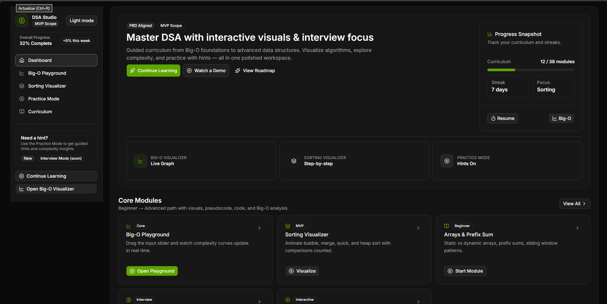
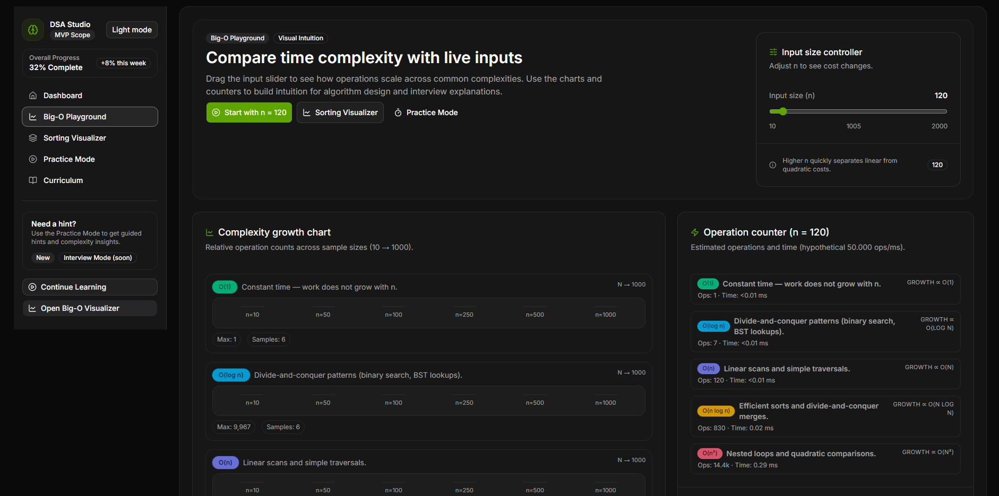
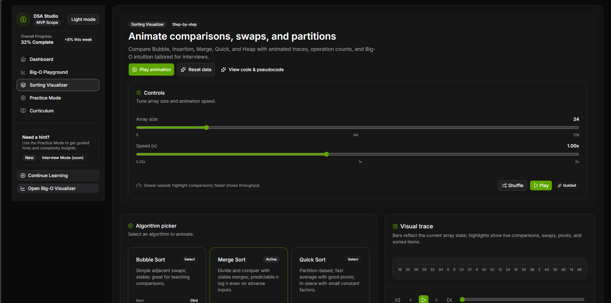
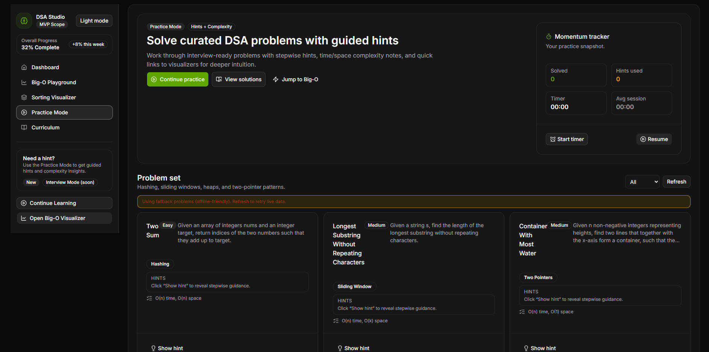
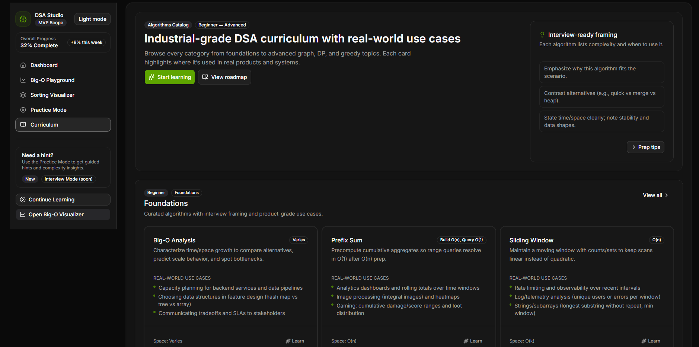

# DSA Studio (React + Vite + Tailwind + shadcn/ui)

DSA Studio is an interactive learning workspace for Data Structures & Algorithms. It includes a Big-O playground, sorting visualizer with step engine, and a practice area with persisted progress. Built with React, Vite, Tailwind CSS, and shadcn/ui.

## Features
- **Dashboard**: Quick entry points to all modules and progress snapshot.
- **Big-O Playground**: Interactive complexity curves and inputs.
- **Sorting Visualizer**: Step-by-step animations (bubble, insertion, merge, quick, heap), controls, and pseudocode modal.
- **Practice Mode**: Guided problems, hints, persisted state via Zustand, in-app problem detail pages.
- **Curriculum**: Structured path across algorithm topics.
- **Theming**: Light/dark toggle persisted to localStorage.
- **Resilient data**: Fallbacks for problem content; timeout-handled fetch client.

## Tech stack
- **Frontend**: React + Vite, React Router, Tailwind CSS, shadcn/ui, lucide-react icons
- **State**: Zustand for persisted practice state
- **Data**: Fetch client with graceful fallbacks for problem data
- **Tooling**: ESLint, Vite aliases (`@` → `src`)

## Project structure (high level)
- `src/pages` — route-level pages (Dashboard, BigOPlayground, SortingVisualizer, Practice, Curriculum, ProblemDetail)
- `src/components` — shared/layout/UI/visualizers
- `src/constants` — algorithm catalogs and static data
- `src/lib` — clients, hooks, utils, store (Zustand)
- `src/assets` — shared assets (if any)
- `screenshots` — product captures used below

## Scripts
- `pnpm install` — install dependencies
- `pnpm dev` — start dev server (uses Vite; ensure ngrok allowed host if tunneling)
- `pnpm build` — production build
- `pnpm preview` — preview production build locally

## Dev server (ngrok note)
- `vite.config.js` includes `allowedHosts` and `ngrok-skip-browser-warning` header.
- HMR uses `wss` with `clientPort: 443`. When tunneling, open the ngrok URL (optionally append `?ngrok-skip-browser-warning=1`).

## Screenshot gallery (inline)
Dashboard  

Big-O Playground  

Sorting Visualizer  

Practice Mode  

Curriculum  

## Getting started
1) Install deps: `pnpm install`  
2) Run dev server: `pnpm dev`  
3) Open `http://localhost:5173` (or your ngrok URL with skip-warning query if needed).

## Notes / next steps
- Sanitize any remote HTML problem content before rendering (consider `sanitize-html`).
- Add React Query (or SWR) for cached data fetching if expanding live APIs.
- Add basic tests (store slice, client fetch, page smoke) and CI (lint/test/build).
- Consider locking body scroll when the mobile drawer is open for extra polish.
